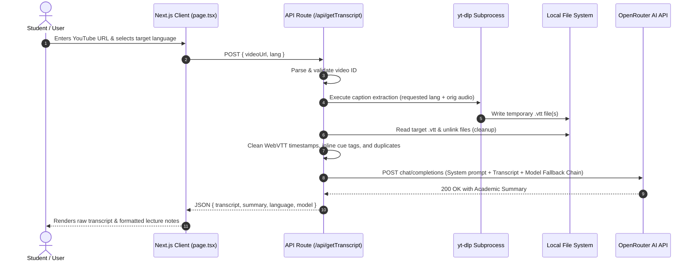

# 🎓 YouTube Lecture Summarizer

[](LICENSE)
[](https://nextjs.org/)
[](https://react.dev/)
[](https://www.typescriptlang.org/)
[](https://tailwindcss.com/)
[](https://openrouter.ai/)

An intelligent, full-stack web application designed for students, researchers, and lifelong learners. It automatically fetches and cleans subtitles from any public YouTube lecture or video (supporting standard links, `youtu.be` shortcuts, and YouTube Shorts) and transforms them into comprehensive, academic-grade structured summaries and actionable key takeaways powered by frontier LLMs via **OpenRouter** (featuring **NVIDIA Nemotron 3 Ultra 550B**, **Meta Llama 3.3 70B**, and **Mistral Small 24B**).

---

## 📑 Table of Contents

- [Key Features](#-key-features)
- [Tech Stack](#-tech-stack)
- [Architecture & Workflow](#-architecture--workflow)
  - [Directory Structure](#directory-structure)
  - [System Flow & Data Pipeline](#system-flow--data-pipeline)
  - [Subtitle Extraction Engine](#subtitle-extraction-engine)
  - [Frontier AI Multi-Model Fallback Chain](#frontier-ai-multi-model-fallback-chain)
- [Prerequisites](#-prerequisites)
- [Getting Started](#-getting-started)
  - [1. Clone Repository](#1-clone-repository)
  - [2. Install Dependencies](#2-install-dependencies)
  - [3. Configure Environment Variables](#3-configure-environment-variables)
  - [4. Verify yt-dlp Engine](#4-verify-yt-dlp-engine)
  - [5. Run Development Server](#5-run-development-server)
- [Environment Variables](#-environment-variables)
- [API Reference](#-api-reference)
  - [`POST /api/getTranscript`](#post-apigettranscript)
- [Available Scripts](#-available-scripts)
- [Production Deployment](#-production-deployment)
  - [Docker Containerization (Recommended)](#docker-containerization-recommended)
  - [Self-Hosted Linux / VPS Deployment](#self-hosted-linux--vps-deployment)
  - [Vercel & Serverless Considerations](#vercel--serverless-considerations)
- [Troubleshooting & FAQs](#-troubleshooting--faqs)
- [Contributing](#-contributing)
- [Author & Acknowledgments](#-author--acknowledgments)
- [License](#-license)

---

## ✨ Key Features

- **⚡ Resilient Subtitle Extraction**: Automatically fetches subtitles and auto-captions via an integrated `yt-dlp` subprocess. Gracefully handles various video formats (`watch?v=`, `youtu.be/`, and `/shorts/`).
- **🧠 Frontier AI Lecture Summarization**: Produces structured academic notes containing:
  - **Executive Overview**: High-level context and thesis of the lecture.
  - **Core Concepts & Key Takeaways**: Deep conceptual analysis.
  - **Structured Bullet Points**: Clear, actionable, and reviewable study points.
- **🌐 Multi-Language Processing**: Summarize and localize lectures across multiple languages, including English (`en`), Spanish (`es`), French (`fr`), German (`de`), Simplified Chinese (`zh-Hans`), and Japanese (`ja`).
- **🛡️ 3-Tier Model Fallback & Retry Logic**: Configured with a fallback chain (`NVIDIA Nemotron 3 Ultra 550B` &rarr; `Llama 3.3 70B Instruct` &rarr; `Mistral Small 24B Instruct`) and automatic backoff retry logic to bypass upstream rate limits (`HTTP 429`) and server overload (`HTTP 503`).
- **🧹 Advanced VTT Sanitization**: Strips WebVTT headers, timecodes (`00:00:00.000 --> ...`), inline styling tags (`<00:00:01.200><c>`), and duplicate lines into clean, unified natural language text.
- **🎨 Modern, Responsive UI**: Designed with Next.js 15 App Router, React 19, Tailwind CSS, Lucide icons, and dual light/dark mode support.
- **🔒 Privacy & Cleanup**: Automatically deletes temporary `.vtt` caption files from local disk immediately after parsing.

---

## 🛠️ Tech Stack

| Layer | Technology | Details |
| :--- | :--- | :--- |
| **Framework** | [Next.js 15.1.6](https://nextjs.org/) | App Router, Server-side API endpoints, Client Components |
| **Frontend Library** | [React 19.0.0](https://react.dev/) | State management, responsive UI rendering |
| **Language** | [TypeScript 5](https://www.typescriptlang.org/) | End-to-end type safety |
| **Styling** | [Tailwind CSS 3.4.1](https://tailwindcss.com/) | Responsive design tokens, CSS variables, dark mode |
| **UI Components** | [Radix UI](https://www.radix-ui.com/) / Lucide React | Accessible primitives (`@radix-ui/react-slot`) and iconography |
| **Extraction Engine**| [`yt-dlp`](https://github.com/yt-dlp/yt-dlp) & [`yt-dlp-exec`](https://github.com/microlinkhq/yt-dlp-exec) | Subprocess caption extraction with multi-language fallback |
| **AI Inference** | [OpenRouter API](https://openrouter.ai/) | Unified API for open frontier LLMs (Nemotron 3 Ultra, Llama 3.3, Mistral) |

---

## 🏗️ Architecture & Workflow

### Directory Structure

```text
ai-youtube-lecture-summarizer/
├── app/
│   ├── api/
│   │   └── getTranscript/
│   │       └── route.ts         # Backend API: Subtitle download, VTT parser & OpenRouter integration
│   ├── favicon.ico              # App favicon
│   ├── globals.css              # Global styles & Tailwind directives
│   ├── layout.tsx               # Root application layout & metadata
│   └── page.tsx                 # Interactive client dashboard (URL input, selectors, output cards)
├── components/
│   └── ui/
│       ├── button.tsx           # Reusable Radix-styled button component
│       ├── input.tsx            # Styled input field component
│       └── textarea.tsx         # Transcript preview textarea component
├── lib/
│   └── utils.ts                 # Utility helpers (clsx & tailwind-merge)
├── public/                      # Static web assets
├── .env.example                 # Template for environment configuration
├── eslint.config.mjs            # ESLint rules configuration
├── next.config.ts               # Next.js build and runtime settings
├── package.json                 # Project dependencies and script declarations
├── postcss.config.mjs           # PostCSS configuration for Tailwind
├── tailwind.config.ts           # Tailwind design tokens and plugin definitions
├── tsconfig.json                # TypeScript compiler configuration
└── LICENSE                      # MIT Open Source License
```

### System Flow & Data Pipeline



### Subtitle Extraction Engine

The application does not rely on fragile web-scraping heuristics. Instead, it utilizes `yt-dlp`:

1. **Resolution Priority**:
   - First checks custom binary defined in `process.env.YT_DLP_PATH`.
   - Checks local node binary at `./node_modules/yt-dlp-exec/bin/yt-dlp.exe`.
   - Checks standard Windows installation at `C:\yt-dlp\yt-dlp.exe`.
   - Falls back to system PATH `yt-dlp`.
2. **Language Fallback Strategy**:
   - Downloads captions matching `"${lang},${lang}-.*,.*-orig"`. If an automated translation in the target language fails or is blocked by YouTube rate limits, it pulls the original spoken subtitles (`.*-orig`).
3. **VTT Sanitizer**:
   - Filters out `WEBVTT` header definitions, language metadata, and standard timestamp intervals (`00:00:00.000 --> 00:00:02.500`).
   - Removes character tags and timestamps formatted like `<00:00:00.160><c>`.
   - Deduplicates repeating lines caused by live rolling captions.

### Frontier AI Multi-Model Fallback Chain

To maintain high availability even during periods of heavy usage on free-tier frontier models:

- **Primary**: `nvidia/nemotron-3-ultra-550b-a55b:free` (Customizable via `AI_MODEL`)
- **Secondary**: `meta-llama/llama-3.3-70b-instruct:free`
- **Tertiary**: `mistralai/mistral-small-24b-instruct-2501:free`
- **Retry Mechanism**: Automatically catches `HTTP 429` (rate limits) or `HTTP 503` (overloaded providers) and attempts re-execution with a 2.5-second backoff delay.

---

## 📋 Prerequisites

Before starting, ensure you have the following installed on your machine:

- **Node.js**: `v18.18.0` or higher (Node.js 20+ LTS recommended)
- **npm** (comes with Node.js), **pnpm**, or **yarn**
- **Python 3.8+** (required by `yt-dlp` if running outside pre-compiled binary environments)
- **OpenRouter API Key**: Obtain a free API key at [openrouter.ai/keys](https://openrouter.ai/keys)

---

## 🚀 Getting Started

### 1. Clone Repository

```bash
git clone https://github.com/Akhassan12/youtube-lecture-summarizer.git
cd youtube-lecture-summarizer
```

### 2. Install Dependencies

Install all project dependencies:

```bash
npm install
```

> **Note for Windows Users**: `npm install` automatically downloads `yt-dlp.exe` through the `yt-dlp-exec` post-install process into `./node_modules/yt-dlp-exec/bin/yt-dlp.exe`.

### 3. Configure Environment Variables

Create your local `.env` file by copying the sample template:

```bash
cp .env.example .env
```

Open `.env` in your code editor and provide your OpenRouter credentials:

```env
# OpenRouter API Key (Mandatory)
OPENROUTER_API_KEY=sk-or-v1-xxxxxxxxxxxxxxxxxxxxxxxxxxxxxxxx

# Primary AI Model (Optional - defaults to NVIDIA Nemotron 3 Ultra)
AI_MODEL=nvidia/nemotron-3-ultra-550b-a55b:free

# Custom yt-dlp executable path (Optional - auto-detected)
# YT_DLP_PATH=/usr/local/bin/yt-dlp
```

### 4. Verify yt-dlp Engine

If you are on Linux or macOS, verify `yt-dlp` is installed globally:

```bash
# macOS (using Homebrew)
brew install yt-dlp

# Ubuntu / Debian
sudo apt update && sudo apt install -y yt-dlp

# Or install via Python pip
pip install -U yt-dlp
```

### 5. Run Development Server

Start the Next.js development server:

```bash
npm run dev
```

Output:

```text
  ▲ Next.js 15.1.6
  - Local:        http://localhost:3000
  - Environments: .env

 ✓ Starting...
 ✓ Ready in 1500ms
```

Open [http://localhost:3000](http://localhost:3000) in your browser.

---

## ⚙️ Environment Variables

The application can be configured using standard environment variables:

| Variable | Required | Default Value | Description |
| :--- | :---: | :--- | :--- |
| `OPENROUTER_API_KEY` | **Yes** | *None* | Authentication token for OpenRouter API requests. |
| `AI_MODEL` | No | `nvidia/nemotron-3-ultra-550b-a55b:free` | The primary LLM to route summarization requests to. |
| `YT_DLP_PATH` | No | Auto-detected | Absolute path to the `yt-dlp` binary on the host machine. |
| `NEXT_PUBLIC_SITE_URL`| No | `http://localhost:3000` | Site URL sent in the `HTTP-Referer` header to OpenRouter. |

---

## 📡 API Reference

### `POST /api/getTranscript`

Extracts video subtitles, cleans text, and generates a structured summary in the requested language.

#### Request Headers

```http
Content-Type: application/json
```

#### Request Body

| Field | Type | Required | Description | Example |
| :--- | :--- | :---: | :--- | :--- |
| `videoUrl` | `string` | **Yes** | Full YouTube URL (`watch?v=`, `youtu.be/`, or `/shorts/`) | `"https://www.youtube.com/watch?v=dQw4w9WgXcQ"` |
| `lang` | `string` | No | Target ISO language code (Default: `"en"`) | `"en"`, `"es"`, `"fr"`, `"de"`, `"zh-Hans"`, `"ja"` |

**Example Request:**

```bash
curl -X POST http://localhost:3000/api/getTranscript \
  -H "Content-Type: application/json" \
  -d '{
    "videoUrl": "https://www.youtube.com/watch?v=kqtD5dpn9C8",
    "lang": "en"
  }'
```

#### Success Response (`200 OK`)

```json
{
  "transcript": "In this lecture, we introduce the fundamentals of neural network architectures...",
  "summary": "### Executive Overview\nThis lecture introduces the core mechanics of artificial neural networks...\n\n### Key Concepts & Core Takeaways\n- Gradient Descent optimization\n- Backpropagation algorithms\n- Activation functions\n\n### Detailed Breakdown\n...",
  "language": "en",
  "model": "nvidia/nemotron-3-ultra-550b-a55b:free"
}
```

#### Error Responses

- **`400 Bad Request`**: Missing `videoUrl` or invalid YouTube URL format.
- **`404 Not Found`**: Subtitles are not available for the requested video or YouTube blocked the subtitle request.
- **`422 Unprocessable Content`**: Subtitles file was downloaded but empty after cleaning.
- **`500 Internal Server Error`**: Missing `OPENROUTER_API_KEY` or upstream AI generation error.

---

## 📜 Available Scripts

Run these scripts from the root directory using your preferred package manager:

| Script | Command | Purpose |
| :--- | :--- | :--- |
| **`dev`** | `npm run dev` | Starts the Next.js dev server with Fast Refresh at `localhost:3000`. |
| **`build`** | `npm run build` | Compiles and optimizes the application for production deployment. |
| **`start`** | `npm run start` | Runs the compiled Next.js production build. |
| **`lint`** | `npm run lint` | Runs ESLint 9 checks to enforce code quality and syntax standards. |

---

## 🚢 Production Deployment

Because this application relies on invoking `yt-dlp` through system child processes, deployment on a containerized host or VPS with Python and `yt-dlp` installed is strongly recommended.

### Docker Containerization (Recommended)

Create a `Dockerfile` in the root of the project:

```dockerfile
FROM node:20-bullseye-slim AS base

# Install Python and yt-dlp dependencies
RUN apt-get update && apt-get install -y --no-install-recommends \
    python3 \
    python3-pip \
    ca-certificates \
    curl \
    && rm -rf /var/lib/apt/lists/*

# Install yt-dlp globally
RUN curl -L https://github.com/yt-dlp/yt-dlp/releases/latest/download/yt-dlp -o /usr/local/bin/yt-dlp \
    && chmod a+rx /usr/local/bin/yt-dlp

WORKDIR /app

# Install dependencies
COPY package*.json ./
RUN npm ci

# Copy source code and build
COPY . .
ENV NEXT_TELEMETRY_DISABLED=1
RUN npm run build

# Set production environment
ENV NODE_ENV=production
ENV PORT=3000
ENV YT_DLP_PATH=/usr/local/bin/yt-dlp

EXPOSE 3000

CMD ["npm", "run", "start"]
```

#### Build & Run with Docker:

```bash
# Build the Docker image
docker build -t youtube-lecture-summarizer .

# Run the container with environment variables
docker run -d \
  -p 3000:3000 \
  --name lecture-summarizer \
  -e OPENROUTER_API_KEY="your_openrouter_api_key_here" \
  -e AI_MODEL="nvidia/nemotron-3-ultra-550b-a55b:free" \
  youtube-lecture-summarizer
```

---

### Self-Hosted Linux / VPS Deployment

To deploy onto an Ubuntu / Debian VPS using `systemd` and `PM2`:

1. **Install Host Dependencies**:
   ```bash
   sudo apt update
   sudo apt install -y nodejs npm python3 yt-dlp git
   sudo npm install -g pm2
   ```

2. **Clone & Setup**:
   ```bash
   git clone https://github.com/Akhassan12/youtube-lecture-summarizer.git /var/www/summarizer
   cd /var/www/summarizer
   npm install
   cp .env.example .env # Edit with your API keys
   npm run build
   ```

3. **Start with PM2**:
   ```bash
   pm2 start npm --name "lecture-summarizer" -- run start
   pm2 save
   pm2 startup
   ```

---

### Vercel & Serverless Considerations

> [!WARNING]
> Vercel Serverless Functions have a maximum execution time (10–60s depending on plan) and do not support arbitrary Python binaries or child process binaries out-of-the-box without custom layers.
>
> If deploying to Vercel, use a standalone backend worker or container for `/api/getTranscript`, or deploy using **Render**, **Railway**, **Fly.io**, or **Docker** where system binaries are fully supported.

---

## 🔧 Troubleshooting & FAQs

### 1. `yt-dlp is not recognized as an internal or external command`
- **Cause**: The `yt-dlp` executable is not in your system `PATH` and was not detected in `node_modules`.
- **Solution**:
  - Run `npm install` to ensure `yt-dlp-exec` binaries are downloaded.
  - Or download `yt-dlp.exe` manually from [yt-dlp releases](https://github.com/yt-dlp/yt-dlp/releases) and place it in `C:\yt-dlp\yt-dlp.exe`.
  - Or specify the exact binary path in your `.env` via `YT_DLP_PATH="C:\path\to\yt-dlp.exe"`.

### 2. `Could not retrieve subtitles for this video (HTTP 429)`
- **Cause**: YouTube's automated request detection flagged your IP address for downloading captions too frequently.
- **Solution**:
  - The application automatically attempts multiple fallback streams (`.*-orig` and native audio).
  - If issues persist, verify that the target YouTube video has Closed Captions (CC) or auto-generated transcripts enabled.
  - On a VPS or datacenter IP, passing cookies via yt-dlp or using a residential proxy solves anti-bot blocks.

### 3. `API key missing. Please set OPENROUTER_API_KEY`
- **Cause**: Next.js cannot find the `OPENROUTER_API_KEY` in environment variables.
- **Solution**:
  - Ensure `.env` is located in the root directory (same level as `package.json`).
  - Restart the Next.js development server (`npm run dev`) after modifying `.env`.

### 4. `Upstream provider overloaded. Retrying in 2.5s...`
- **Cause**: The requested free frontier model on OpenRouter is experiencing peak global load.
- **Solution**: The application automatically falls back to **Llama 3.3 70B** and **Mistral Small 24B**. If you prefer a dedicated commercial endpoint, switch `AI_MODEL` in `.env` to any model supported by OpenRouter (e.g., `openai/gpt-4o-mini` or `anthropic/claude-3.5-haiku`).

---

## 🤝 Contributing

Contributions are welcome! Please follow these steps:

1. **Fork the Project**: Click the "Fork" button on GitHub.
2. **Create a Feature Branch**:
   ```bash
   git checkout -b feature/AmazingFeature
   ```
3. **Commit Your Changes**:
   ```bash
   git commit -m 'Add some AmazingFeature'
   ```
4. **Push to the Branch**:
   ```bash
   git push origin feature/AmazingFeature
   ```
5. **Open a Pull Request**: Submit your PR on GitHub with a description of your modifications.

---

## 👤 Author & Acknowledgments

- **Lead Developer**: [Ali Hassan Kadri](https://github.com/Akhassan12)
- **Contact**: [hasanqadri1990@gmail.com](mailto:hasanqadri1990@gmail.com)
- **GitHub**: [@Akhassan12](https://github.com/Akhassan12)
- **Inspirations**: [yt-dlp](https://github.com/yt-dlp/yt-dlp) and [OpenRouter](https://openrouter.ai/).

---

## 📄 License

This project is licensed under the **MIT License** — see the [LICENSE](LICENSE) file for complete details.
